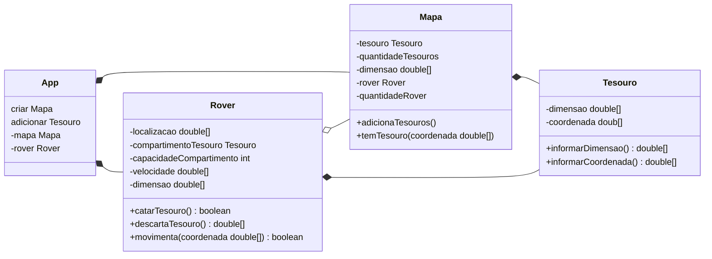

```mermaid
classDiagram
    direction LR
    
    class App{
        criar Mapa
        adicionar Tesouro
      -mapa Mapa
      -rover Rover
    }
    
    class Rover{
        -localizacao double[]
        -compartimentoTesouro Tesouro
        -capacidadeCompartimento int
        -velocidade double[]
        -dimensao double[]
        +catarTesouro() boolean
        +descartaTesouro() double[]
        +movimenta(coordenada double[]) boolean
    }
    
    class Mapa{
        -tesouro Tesouro
        -quantidadeTesouros
        -dimensao double[]
        -rover Rover
        -quantidadeRover
        
        +adicionaTesouros()
        +temTesouro(coordenada double[])
               
    } 

    class Tesouro{
        -dimensao double[]
        -coordenada doub[]
        +informarDimensao() double[]
        +informarCoordenada() double[]
    }
    App     *-- Mapa
    App     *-- Rover
    Mapa    *-- Tesouro
    Rover   *-- Tesouro
    Rover   o-- Mapa
```